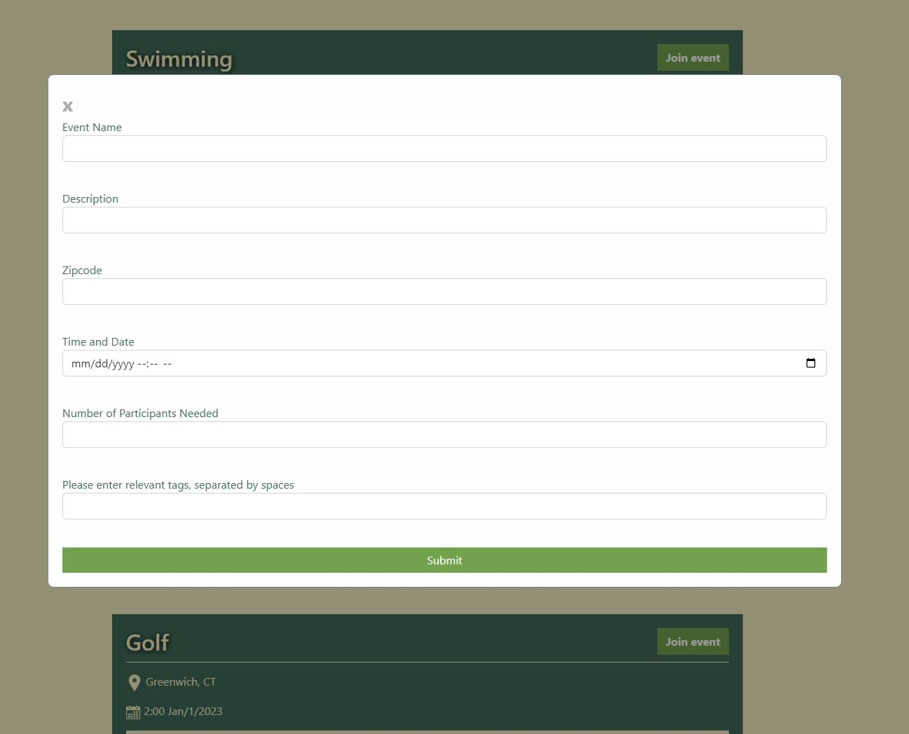
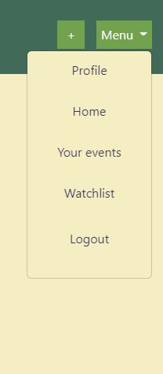

# We Do: The Squad Up App

## Description

We Do is an app for the active an social who need to find people to perform activities with. From filling a spot at a round of Golf to finding a full pit crew for your aspiring rally team, We Do has you covered. 

## Table of Contents. 

- [Installation](#installation)
- [Usage](#usage)
- [License](#license)
- [Technologies](#technologies)
- [Contributors](#contributors)
- [Screenshots](#screenshots)
- [Contact](#contact)

## Installation

We Do is deployed on Heroku at https://we-do-application.herokuapp.com/

## Usage

In the app, you will be able to sign up using your email and your ZIP code. Using the Zip Code, you'll be able to find events nearby you. Please see screenshots for more instructions on how to use this application.

## License

MIT License

Copyright (c) 2022 Richie Thiesfeldt, Mitchell Lemieux, Jonathan Sadowski, Jesus Marquez, Ryan Jackson

Permission is hereby granted, free of charge, to any person obtaining a copy
of this software and associated documentation files (the "Software"), to deal
in the Software without restriction, including without limitation the rights
to use, copy, modify, merge, publish, distribute, sublicense, and/or sell
copies of the Software, and to permit persons to whom the Software is
furnished to do so, subject to the following conditions:

The above copyright notice and this permission notice shall be included in all
copies or substantial portions of the Software.

THE SOFTWARE IS PROVIDED "AS IS", WITHOUT WARRANTY OF ANY KIND, EXPRESS OR
IMPLIED, INCLUDING BUT NOT LIMITED TO THE WARRANTIES OF MERCHANTABILITY,
FITNESS FOR A PARTICULAR PURPOSE AND NONINFRINGEMENT. IN NO EVENT SHALL THE
AUTHORS OR COPYRIGHT HOLDERS BE LIABLE FOR ANY CLAIM, DAMAGES OR OTHER
LIABILITY, WHETHER IN AN ACTION OF CONTRACT, TORT OR OTHERWISE, ARISING FROM,
OUT OF OR IN CONNECTION WITH THE SOFTWARE OR THE USE OR OTHER DEALINGS IN THE
SOFTWARE.

## Technologies
Technologies used include Node.js, Express, MySQL, Sequelize, express-session, and Google Geocoding API.

## Contributors

[@ddwk21](https://github.com/ddwk21) Mitchell Lemieux 
[@jsadowski](https://github.com/jwsadowski) Jonathan Sadowski 
[@Jay-MM](https://github.com/Jay-MM) Jesus Marquez 
[@richiethie](https://github.com/richiethie) Richie Thiesfeldt 
[@JimothyThunderguns](https://github.com/JimothyThunderguns) Ryan Jackson 

## Screenshots
Below are screenshots of the different page views used in this application.

The first view the user is presented with is the Login page.

If the user does not have an account they can create one by clicking "Create Account".

Once the user logs in, they will be brought to the home page where it will display all of the events in the area of this user.

From here, the user is able to join an event and also create a new event by clicking on the + button in the top right corner.

Finally, if the user is done using the app, they can click on "Menu" and click on "Logout" to have their account signed out, and will be returned back to the Login page.

## Contact

Feel free to reach out with any questions or ideas via any of the groups GitHub accounts, or send Richie an email @ richiethie@gmail.com.